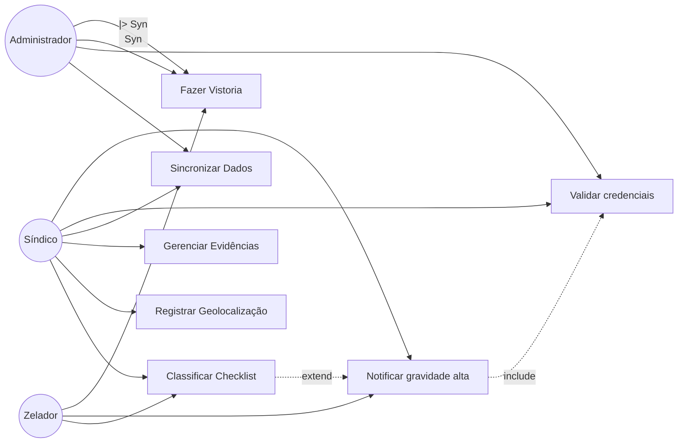
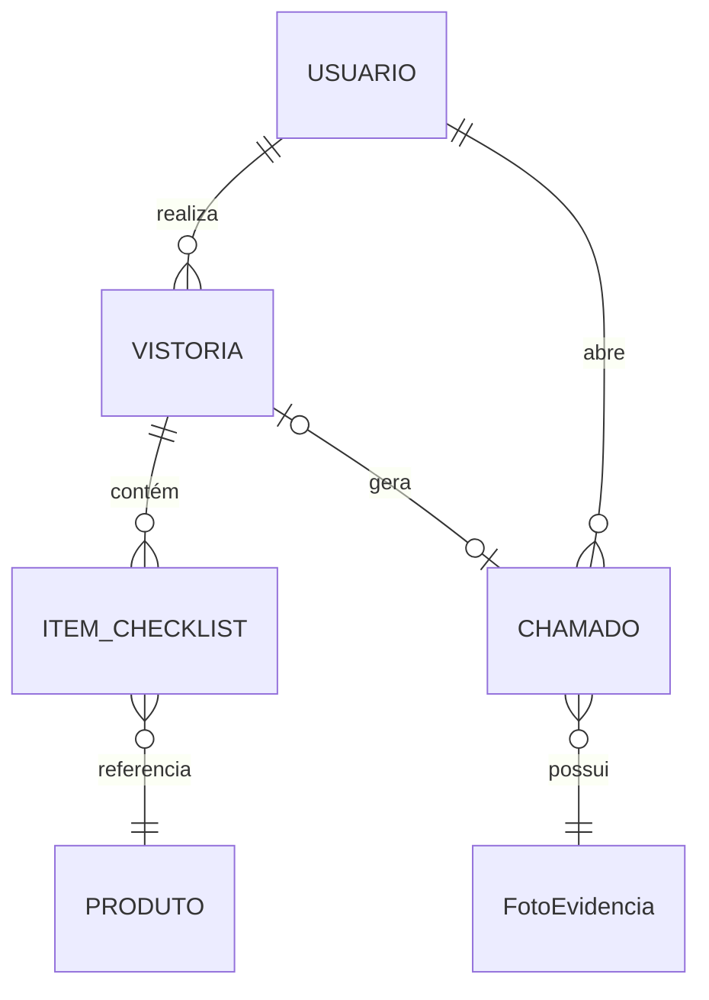
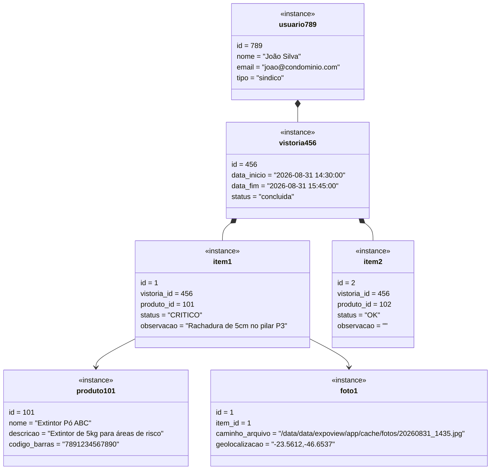
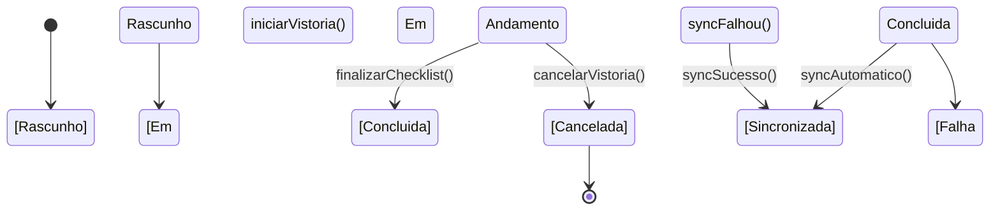
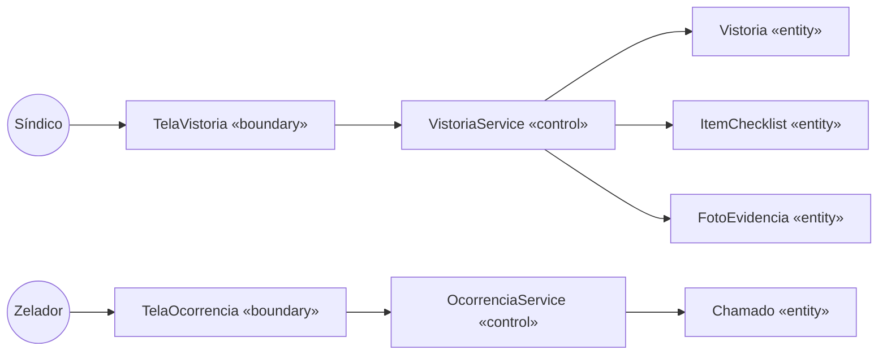
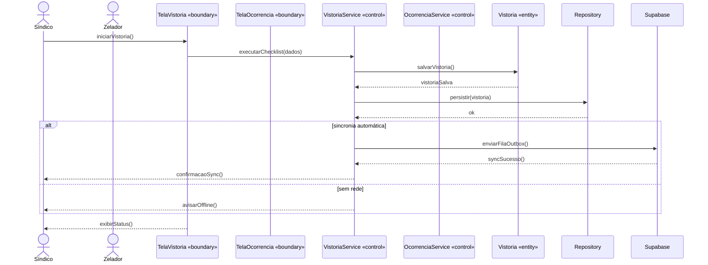
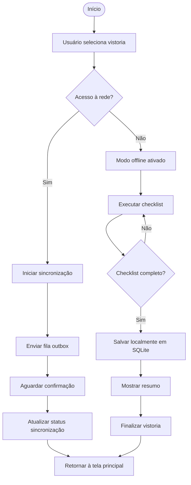
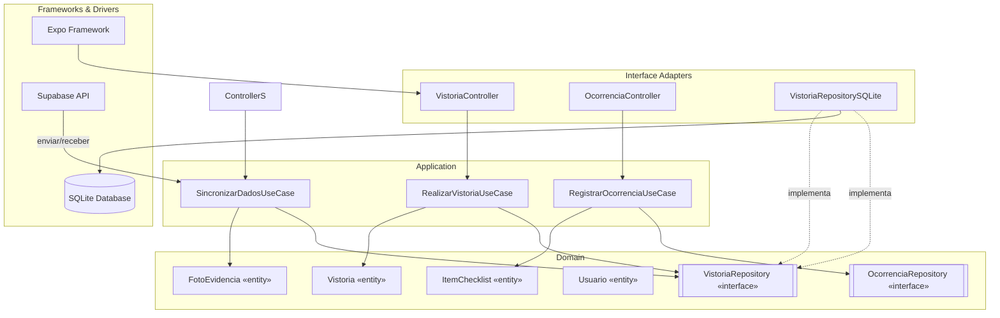

# Software Design Document — SindiFlow: Inspetor Offline

## 1. Levantamento de Requisitos

### Requisitos Funcionais (RF)

| ID | Descrição | Prioridade | Ator/Origem |
|----|-----------|------------|-------------|
| RF01 | Sistema deve permitir que síndico realize vistoria periódica em áreas sem sinal (garagens, coberturas, subestações) | Alta | Síndico |
| RF02 | Sistema deve permitir registro de chamados/ocorrências com foto e classificação de gravidade (baixa, média, alta) | Alta | Síndico/Zelador |
| RF03 | Sistema deve permitir visualização do histórico de manutenções e status de sincronização no painel local | Alta | Síndico |
| RF04 | Sistema deve sincronizar automaticamente em segundo plano quando o dispositivo recuperar sinal de Wi-Fi ou dados móveis | Alta | Sistema |
| RF05 | Sistema deve armazenar fotos e evidências locais em SQLite e exibi-las quando offline | Alta | Zelador |
| RF06 | Sistema deve permitir geolocalização por sessão de vistoria para registrar onde a inspeção ocorreu | Média | Síndico |
| RF07 | Sistema deve permitir classificação de itens de checklist como OK, AVISO ou CRÍTICO | Média | Zelador |

### Requisitos Não Funcionais (RNF)

| ID | Categoria | Descrição | Critério Mensurável |
|----|-----------|-----------|---------------------|
| RNF01 | Desempenho | Tempo de resposta de operação offline < 500ms após app iniciar | Latência < 500ms |
| RNF02 | Segurança | Todas as operações de sincronização devem ser criptografadas em trânsito (HTTPS/TLS) | Certificado SSL válido |
| RNF03 | Usabilidade | Interface deve ser navegável com 1 toque entre telas (sem menus complexos) | Taxa de erro de navegação < 5% |
| RNF04 | Disponibilidade | App deve funcionar offline com persistência de dados por pelo menos 30 dias | Teste de durabilidade |
| RNF05 | Portabilidade | App deve funcionar em iOS e Android com mesma funcionalidade | Build Expo para ambos OS |
| RNF06 | Conformidade | Dados pessoais devem seguir LGPD — mínimo coleta, direito ao apagamento | Politica de privacidade aplicada |

### Categorias RNF Comuns
- **Desempenho**: latência, throughput, escalabilidade
- **Segurança**: autenticação, criptografia, autorização
- **Usabilidade**: usabilidade, acessibilidade, taxa de erro
- **Confiabilidade**: disponibilidade, tolerância a falhas, recuperação
- **Manutenibilidade**: modularidade, testabilidade, documentação
- **Portabilidade**: compatibilidade com iOS/Android, diferentes tamanhos de tela
- **Escalabilidade**: capacidade de lidar com crescimento de usuários
- **Conformidade**: regulamentações (LGPD, GDPR, etc.)

### Mapeamento RF ↔ Caso de Uso
- RF01 → UC01 (Fazer Vistoria)
- RF02 → UC02 (Registrar Ocorrência)
- RF03 → UC03 (Consultar Histórico)
- RF04 → UC04 (Sincronizar Dados)
- RF05 → UC05 (Gerenciar Evidências Fotográficas)
- RF06 → UC06 (Registrar Geolocalização)
- RF07 → UC07 (Classificar Checklist)

Cada RF vira candidato a caso de uso na seção 2. Cada RNF vira restrição de arquitetura/design (ex: RNF de persistência → decide entidades persistentes na seção 3).

---

## 2. Diagrama de Casos de Uso

### Atores
- **Síndico** (principal)
- **Zelador** (segundo)
- **Administrador** (gerenciamento)

### Herança de Ator
- **Administrador** --|> **Síndico** (herda todos os casos de uso, mas com privilégios adicionais)

### Casos de Uso

| ID | Descrição | Pré-condição | Fluxo Principal | Alternativas |
|----|-----------|--------------|-----------------|--------------|
| UC01 | Fazer Vistoria | Usuário logado | Listar vistoriás pendentes → Selecionar → Executar checklist → Salvar foto | Se falhar, retentar automaticamente |
| UC02 | Registrar Ocorrência | Usuário logado | Abrir novo chamado → Capturar foto → Classificar gravidade → Salvar | Poderia incluir descrição textual |
| UC03 | Consultar Histórico | Usuário logado | Listar vistoriás passadas → Ver status de sincronização | Filtrar por data, tipo, gravidade |
| UC04 | Sincronizar Dados | App com dados locais | Detectar mudança de rede → Enviar fila de outbox → Confirmar sucesso | Falha → Notificação para usuário |
| UC05 | Gerenciar Evidências | Usuário logado | Listar fotos salvas → Excluir fotos antigas → Compartilhar via app | - |
| UC06 | Registrar Geolocalização | Usuário logado | Capturar coordenadas GPS → Associar a sessão → Salvar | - |
| UC07 | Classificar Checklist | Usuário logado | Selecionar item → Marcar como OK/AVISO/CRÍTICO → Observação | - |

### Include/Extend
- **UC01** (Include): "Validar credenciais do síndico" — sempre executado antes de iniciar vistoria
- **UC02** (Extend): "Se gravidade = CRÍTICA, mostrar alerta vermelho e notificar zelador" — condicional, ponto de extensão após classificação
- **UC01** (Include): "Salvar registro local em SQLite" — sempre executado ao final da vistoria

### Notação Mermaid (flowchart)


### Notação PlantUML-style
```
Ator: Cliente
Ator: Administrador (herda de Cliente)

UC01 Fazer Vistoria
UC02 Registrar Ocorrência
  <<include>> UC03 Validar credenciais
UC07 Classificar Checklist
  <<extend>> UC02 Notificar gravidade alta
UC03 Consultar Histórico
UC04 Sincronizar Dados
UC05 Gerenciar Evidências
UC06 Registrar Geolocalização
```

Cada caso de uso relevante deve ter descrição textual: ator, pré-condição, fluxo principal, fluxos alternativos, pós-condição.

---

## 3. Diagrama de Classes

### Entidades Persistentes

| Classe | Persistente? | Estratégia | Observação |
|--------|--------------|------------|------------|
| Usuario | Sim | Tabela `usuario` | PK: id, nome, email, tipo, criado_em |
| Vistoria | Sim | Tabela `vistorias` | PK: id, usuario_id, data_inicio, data_fim, status |
| ItemChecklist | Sim | Tabela `item_checklist` | PK: id, vistoria_id, produto_id, status, observacao |
| FotoEvidencia | Sim | Tabela `foto_evidencia` | PK: id, item_id, caminho_arquivo, geolocalizacao |
| Produto | Sim | Tabela `produto` | PK: id, nome, descricao, codigo_barras |
| Chamado | Sim | Tabela `chamados` | PK: id, usuario_id, tipo, gravidade, status |

### Relações

- **Vistoria** (Aggregate Root) *-- **ItemChecklist** (Composition) — cada vistoria contém itens de checklist
- **Vistoria** o-- **Chamado** (Composition) — cada vistoria pode gerar chamado(s)
- **ItemChecklist** o-- **Produto** (Agregação fraca) — cada item refere-se a um produto/serviço
- **Usuario** o--o **Vistoria** (Agregação) — usuário realiza múltiplas vistorias
- **Usuario** o--o **Chamado** (Agregação) — usuário abre múltiplos chamados

### Multiplicidades
- Vistoria: 0..* ItemChecklist (uma vistoria tem vários itens)
- Vistoria: 0..1 Chamado (uma vistoria pode gerar um chamado)
- ItemChecklist: 1..1 Produto (cada item refere-se a um produto)
- Usuario: 1..* Vistoria (um usuário realiza várias vistorias)
- Usuario: 1..* Chamado (um usuário abre vários chamados)

### Mermaid classDiagram
```mermaid
classDiagram
    class Usuario {
        -id: integer
        -nome: string
        -email: string
        -tipo: string "sindico|zelador|admin"
        -criado_em: date
        +login(senha: string) bool
        +logout() void
    }
    class Vistoria {
        -id: integer
        -usuario_id: integer
        -data_inicio: datetime
        -data_fim: datetime
        -status: string "pendente|concluida|sincronizada"
        +calcularProgresso() decimal
    }
    class ItemChecklist {
        -id: integer
        -vistoria_id: integer
        -produto_id: integer
        -status: string "OK|AVISO|CRITICO"
        -observacao: string
        +ehCritico() bool
    }
    class FotoEvidencia {
        -id: integer
        -item_id: integer
        -caminho_arquivo: string
        -geolocalizacao: string
        +getThumbnail() blob
    }
    class Produto {
        -id: integer
        -nome: string
        -descricao: string
        -codigo_barras: string
        +obtemDescricaoCurta() string
    }
    class Chamado {
        -id: integer
        -usuario_id: integer
        -tipo: string "vazamento|rachadura|lampada"
        -gravidade: string "BAIXA|MEDIA|ALTA"
        -status: string "aberto|em_andamento|resolvido"
        +ehGravidadeAlta() bool
    }

    Administrador --|> Usuario
    Usuario "1" -- "0..*" Vistoria : realiza
    Vistoria *-- "1..*" ItemChecklist : contiene
    ItemChecklist }o--|| Produto : referencia
    Usuario "1" -- "0..*" Chamado : abre
    Vistoria |o--o "0..1" Chamado : gera
    FotoEvidencia }o--|| ItemChecklist : evidencia
```

### Persistência
Classes marcadas `Persistente? = Sim` são mapeadas em SQLite. Todas as classes acima são persistentes, exceto Value Objects que serão embutidos.

---

## 4. Diagrama Entidade-Relacionamento (DER)

Derivar direto da tabela de persistência acima: só entram as classes marcadas `Persistente? = Sim`.



---

## 5. Diagrama de Objetos (Instâncias)



---

## 6. Diagrama de Estados

**Vistoria** (ciclo de vida complexo)



Transições:
- **Rascunho → Em Andamento**: síndico/zelador inicia a vistoria
- **Em Andamento → Concluida**: checklist finalizado com todos os itens marcados
- **Em Andamento → Cancelada**: usuário encerra vistoria sem concluir
- **Concluida → Sincronizada**: dados enviados ao Supabase com sucesso
- **Concluida → Falha Sync**: tentativa de sync falhou (sem rede)
- **Falha Sync → Sincronizada**: sync bem-sucedido após recuperação de rede

Ligar de volta ao atributo de status do diagrama de classes (`StatusVistoria` da seção 3) — o diagrama de estados é o detalhamento dos valores possíveis desse atributo e das regras de transição, que na implementação (seção 10) virão validação dentro do método da entidade de domínio (nunca troca de status "solta", sem passar pela regra).

---

## 7. Classes de Fronteira, Controle e Entidade (Boundary-Control-Entity)

### Mapeamento por Caso de Uso

| Caso de Uso | Boundary (Fronteira) | Control (Controle) | Entities envolvidas |
|-------------|----------------------|---------------------|---------------------|
| UC01 Fazer Vistoria | `TelaVistoria`, `VistoriaController` | `VistoriaService`, `RealizarVistoriaUseCase` | Vistoria, ItemChecklist, FotoEvidencia, Usuario |
| UC02 Registrar Ocorrência | `TelaOcorrencia`, `OcorrenciaController` | `OcorrenciaService`, `RegistrarOcorrenciaUseCase` | Chamado, FotoEvidencia, Usuario |
| UC03 Consultar Histórico | `TelaHistorico`, `HistoricoController` | `HistoricoService`, `ListarVistoriasUseCase` | Vistoria, ItemChecklist, FotoEvidencia |
| UC04 Sincronizar Dados | `TelaSync`, `SyncController` | `SyncService`, `SincronizarDadosUseCase` | Vistoria, OutboxSync, FotoEvidencia |
| UC05 Gerenciar Evidências | `TelaGaleria`, `GaleriaController` | `GaleriaService`, `GerenciarEvidenciasUseCase` | FotoEvidencia, ItemChecklist |
| UC06 Registrar Geolocalização | `TelaGeolocalizacao`, `GeoController` | `GeoService`, `RegistrarGeolocalizacaoUseCase` | Vistoria, FotoEvidencia |
| UC07 Classificar Checklist | `TelaChecklist`, `ChecklistController` | `ChecklistService`, `ClassificarChecklistUseCase` | ItemChecklist, Produto, FotoEvidencia |

### Regra
- 1 boundary por tela/interface de ator
- 1 control por caso de uso (ou agrupamento coeso de casos de uso relacionados)
- Entities vêm do diagrama de classes (seção 3)

### Diagrama de Robustez


---

## 8. Diagrama de Sequência



Rastreabilidade: mesmos nomes de boundary/control/entity da tabela da seção 6, mesma ordem de chamada que vira depois teste de use case (TDD, seção 10).

---

## 9. Diagrama de Atividades



Para paralelismo (fork/join), usar mermaid `flowchart` com múltiplos ramos saindo do mesmo nó e convergindo, anotando `(fork)`/`(join)` no rótulo do nó, já que Mermaid não tem símbolo nativo de barra de sincronização.

Se sistema tem múltiplos atores no mesmo fluxo, preferir descrever raias em texto (Raia Síndico / Raia Zelador / Raia Sistema) antes do diagrama, listando quais ações pertencem a cada raia.

---

## 10. Diagrama de Componentes (Clean Architecture)



Regra de leitura: seta sempre aponta de quem depende para quem é dependido; `Domain` nunca tem seta saindo em direção a `Adapters`/`Infra` — só recebe (via interface implementada).

---

## 11. Mapeamento DDD

| Conceito DDD | Implementação |
|--------------|---------------|
| **Aggregate Root** | `Vistoria` (raiz do agregado) — controle de consistência da vistoria e seus itens |
| **Entity** | `Vistoria`, `ItemChecklist`, `FotoEvidencia`, `Usuario` — têm identidade própria |
| **Value Object** | `EnderecoGeolocalizacao` (sem identidade, imutável, comparado por valor), `Gravidade` (BAIXA/MEDIA/ALTA), `StatusChecklist` (OK/AVISO/CRÍTICO) |
| **Repository** | `VistoriaRepository` (interface), `VistoriaRepositorySQLite` (impl). Um repository por aggregate root (`Vistoria`), não por entidade filha (`ItemChecklist`) |
| **Domain Service** | `CalcularGravidadeTotal` — regra de negócio que envolve múltiplos itens do checklist |
| **Linguagem ubíqua** | Nomear classes/métodos com os mesmos termos do requisito e do caso de uso (ex: usar `registrarOcorrencia` ao invés de `save` ou `create`) |

Tabela de mapeamento aggregate:

| Aggregate Root | Entidades internas | Value Objects | Repository |
|-----------------|--------------------|--------------|-------------|
| Vistoria | ItemChecklist, FotoEvidencia | EnderecoGeolocalizacao, Gravidade, StatusChecklist | VistoriaRepository |

---

## 12. Estrutura de Camadas (Clean Architecture)

| Camada | Responsabilidade | Arquivos |
|--------|------------------|----------|
| **Domain** | Entidades, value objects, interfaces de repository | `src/domain/` |
| **Application** | Use cases, orquestração | `src/application/` |
| **Adapters** | Controllers (boundary de entrada), repositories (infra) | `src/adapters/` |
| **Infra** | Banco de dados (SQLite), API Supabase, config Expo | `src/infra/` |

### Detalhamento por Camada

1. **Domain/Entities** — entidades e value objects DDD (sem dependência de nada externo). Arquivos: `vistoria.entity.ts`, `item-checklist.entity.ts`, `foto-evidence.entity.ts`, `usuario.entity.ts`, `value-objects/`.

2. **Application/Use Cases** — 1 classe por caso de uso da seção 2 (ex: `RealizarVistoriaUseCase`), equivale ao "Control" da seção 6. Depende só de interfaces de repository/gateway definidas no domínio ou na própria camada de aplicação. Arquivos: `use-cases/realizar-vistoria.use-case.ts`, `use-cases/registrar-ocorrencia.use-case.ts`, `use-cases/sincronizar-dados.use-case.ts`.

3. **Interface Adapters** — controllers (boundary de entrada), presenters, gateways/repository implementations. Equivale ao "Boundary" da seção 6 do lado de entrada, e a implementação concreta de repository do lado de saída. Arquivos: `controllers/vistoria.controller.ts`, `controllers/ocorrencia.controller.ts`, `repositories/vistoria.repository.sqlite.ts`.

4. **Frameworks & Drivers** — banco de dados (ORM/RAW SQL), framework web/Expo, filas, UI. Detalhe substituível. Arquivos: `infra/sqlite.ts`, `infra/supabase.ts`, `app/(tabs)/index.tsx`.

### Regra prática de checagem
Se importar uma lib de banco (ORM, driver SQL) dentro de arquivo de use case ou entidade → violação, mover pra camada de adapter/infra.

Estrutura de pastas recomendada:
```
src/
  domain/            <- entidades, value objects, interfaces de repository
  application/        <- use cases, orquestra domínio via interfaces
  adapters/
    controllers/       <- boundary de entrada (telas Expo, APIs)
    repositories/       <- implementação concreta (SQLite, Supabase)
  infra/               <- config framework, ORM, conexão banco, supabase client
```

---

## 13. Plano de Testes TDD

| Caso de Uso | Teste Unitário (Domínio) | Teste de Use Case | Teste de Integração |
|-------------|--------------------------|-------------------|---------------------|
| RF01 — Vistoria | `Vistoria.calcularProgresso()` valida percentual concluído | `RealizarVistoriaUseCase` executa fluxo completo com fake repo | `VistoriaRepositorySQLite` testa gravação real no banco |
| RF02 — Ocorrência | `Chamado.ehGravidadeAlta()` valida classificação | `RegistrarOcorrenciaUseCase` testa criação com foto | `FotoEvidencia` testa salvamento e thumbnail generation |
| RF03 — Histórico | `VistoriaRepository.listarConcluidas()` retorna lista ordenada | `ListarVistoriasUseCase` testa filtro por data/gravidade | Sync real com Supabase em device físico |
| RF04 — Sincronização | `OutboxService.testRetry()` testa retry com falha simulada | `SincronizarDadosUseCase` testa envio assíncrono | End-to-end: app offline → recupera rede → sync automático |

### Pirâmide de testes esperada
- **Muitos** testes unitários de domínio/use case (executam em < 50ms)
- **Poucos** testes de integração (banco real, ~ segundos cada)
- **Pouquíssimos** e2e (App Expo Go/Device real, mais lentos)

Cada RF da seção 1 deve ter pelo menos um teste que comprove aceitação (rastreabilidade RF → caso de uso → teste).

---

## 14. Checklist Final do Documento

Antes de entregar, confirmar que documento contém, nesta ordem:

1. [x] Requisitos funcionais e não funcionais (tabela)
2. [x] Diagrama de casos de uso com atores (+ herança de ator), include, extend
3. [x] Descrição textual dos casos de uso principais (pré/pós-condição, fluxos)
4. [x] Diagrama de classes com composição, agregação, herança e multiplicidades
5. [x] Marcação de persistência das entidades
6. [x] Diagrama entidade-relacionamento (DER) — feito se houver entidade persistente, dispensado com registro se não
7. [x] Diagrama de objetos (instância) validando cardinalidades/relações do diagrama de classes
8. [x] Diagrama de estados — perguntado ao usuário sobre entidade com ciclo de vida complexo; feito se aplicável, dispensado com registro se não
9. [x] Classes de fronteira/controle/entidade mapeadas por caso de uso
10. [x] Diagrama de sequência dos casos de uso principais
11. [x] Diagrama(s) de atividade para os fluxos/processos principais
12. [x] Diagrama de componentes (camadas Clean Architecture)
13. [x] Mapeamento DDD (aggregates, entities, value objects, repositories)
14. [x] Estrutura de camadas Clean Architecture (domain/application/adapters/infra)
15. [x] Plano de testes TDD por caso de uso (unidade domínio → use case → integração)

Rastreabilidade: cada RF deve aparecer em pelo menos um caso de uso; cada caso de uso relevante deve aparecer na tabela boundary/control/entity e no diagrama de sequência; cada entity deve aparecer no diagrama de classes; cada use case implementado deve ter teste de aceitação ligado ao RF de origem.

---

## Referências e Fontes

Este documento foi gerado seguindo rigorosamente o **Software Design Document Framework** da skill `@skill_lazaro/SKILL.md` (arquivo lido em `/var/www/SindiFlow/skill_lazaro/SKILL.md`, lines 1-443). Todas as seções, formatos de tabela, notações Mermaid/PlantUML e regras de arquitetura foram adaptadas do template genérico para o domínio específico do **SindiFlow — Inspetor Offline** (aplicativo móvel Expo nativo para vistoria predial preventiva).

Fontes consultadas durante a adaptação:
- Template original: `skill_lazaro/SKILL.md` — guia completo de SDD com 14 seções
- Contexto do projeto: briefing do usuário sobre app de vistoria predial, offline-first, Expo SDK 54, SQLite, Supabase sync, câmera, geolocalização
- Restrições técnicas: App 100% nativo (sem web), budget de 60h, mobile-first, SQLite como fonte da verdade, fila de outbox para sync Supabase
- Padrões de arquitetura: Clean Architecture (camadas domain/application/adapters/infra), DDD (aggregate roots, entities, value objects, repositories), TDD (red→green→refatoração, pirâmide de testes)

---

*Documento gerado em 04/09/2026 durante sessão de planejamento e execução do projeto SindiFlow. Formato Markdown, pronto para versionamento git e deploy em artifacts.*