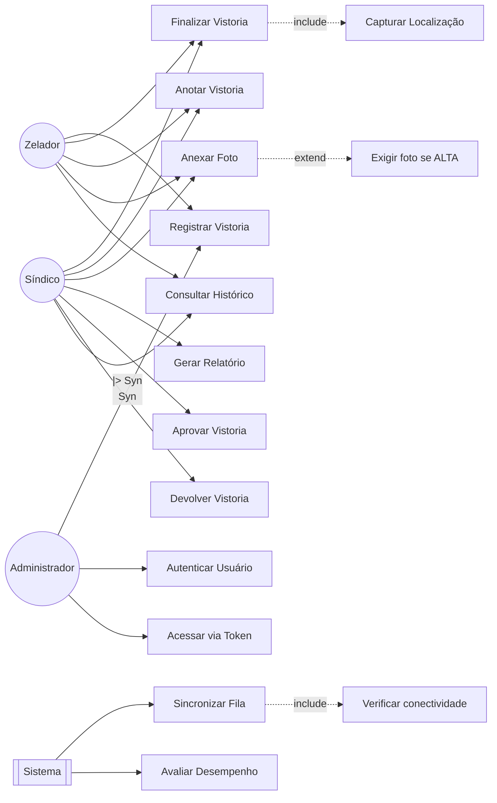
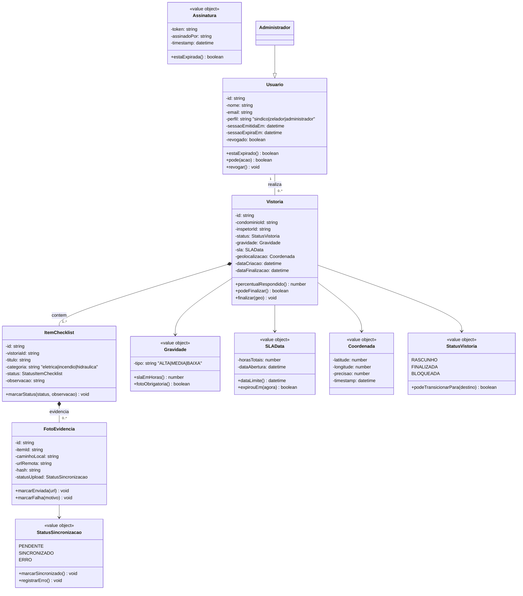
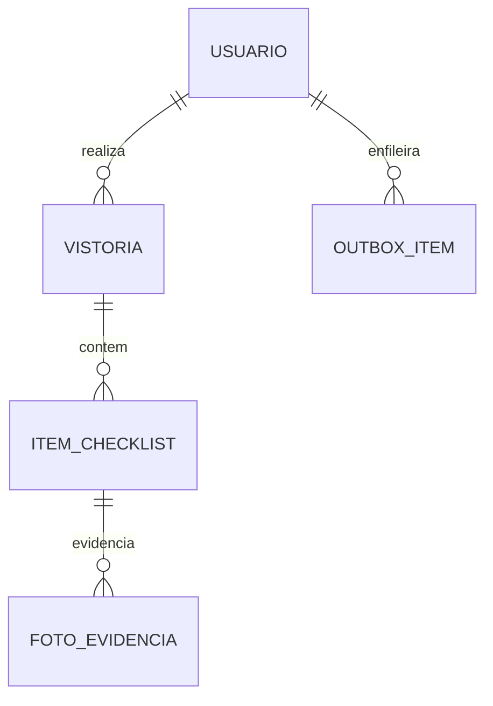
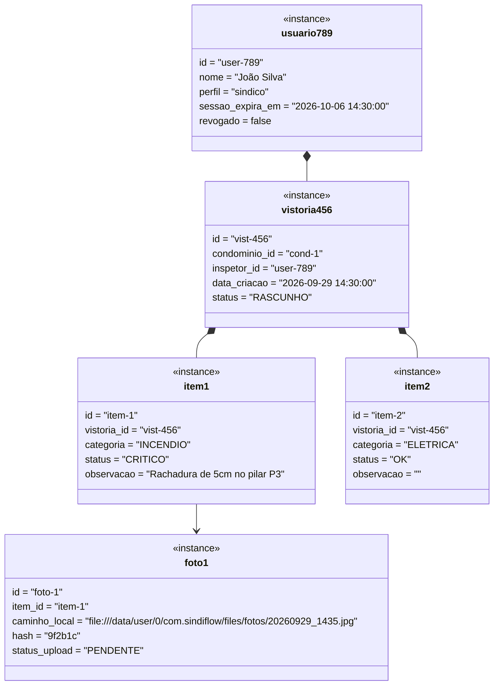
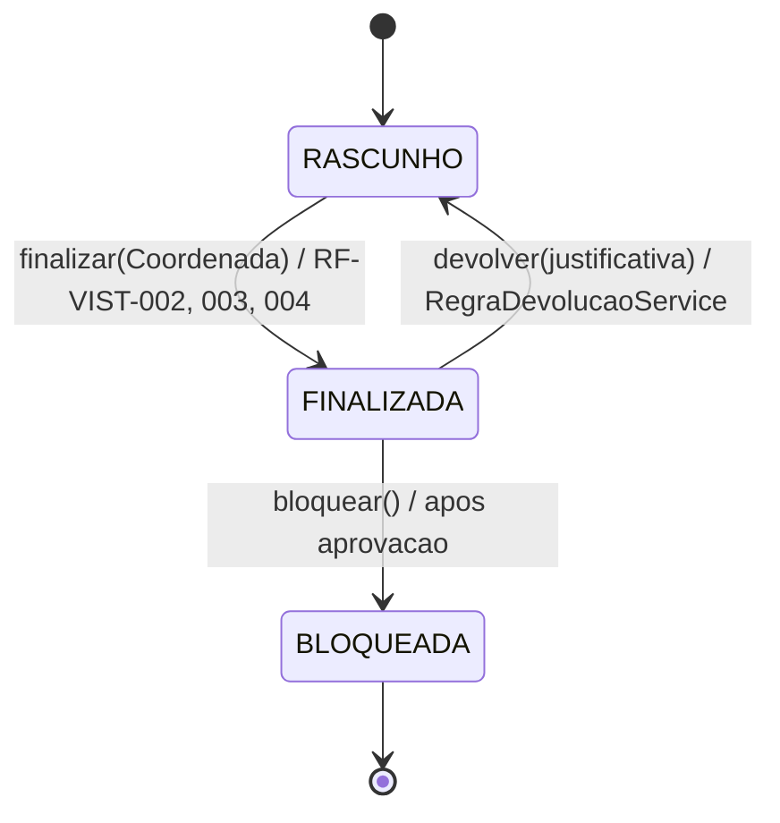
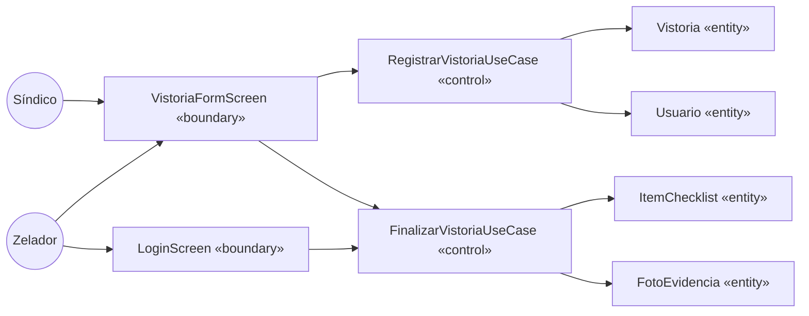
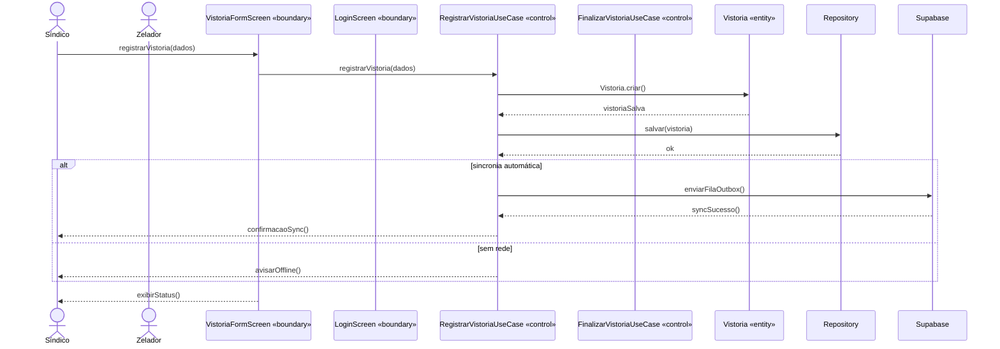
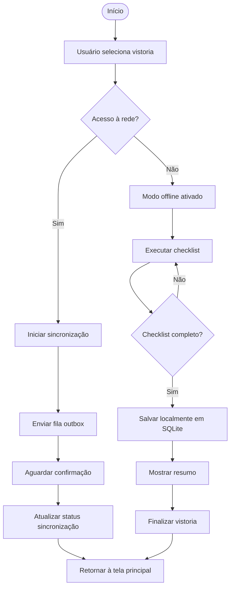
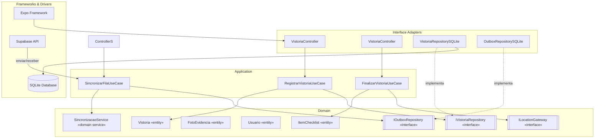

# Software Design Document — SindiFlow: Inspetor Offline

## 0. Decisões de Arquitetura Vigentes

Camada tocada na Fase 0: **documentação** (`docs/`, `chat_history/`). Nenhuma camada de código (`domain`/`application`/`adapters`/`infra`) foi escrita e nenhuma dependência foi instalada.

| ID | Decisão | Motivo / Origem |
|----|---------|-----------------|
| D-01 | O Aggregate Root é **`Vistoria`**. Gravidade, SLA, evidências, geolocalização e assinaturas são atributos da `Vistoria`. **Não existe** entidade `Ocorrencia` | Desvio literal de `chat_history/presentation-06-10-26.md` (linhas 35, 74, 93, 171), alinhado ao código já testado em `src/domain/entities/vistoria.entity.ts` |
| D-02 | `CriarVistoriaUseCase` é absorvido por `RegistrarVistoriaUseCase`; `FinalizarVistoriaUseCase` é mantido | Passo 5 da apresentação + 5 specs já existentes |
| D-03 | O Passo 5 cobre os **15 casos de uso** de §2, não apenas os 8 do checklist do Passo 5 | Escolha de completude de domínio |
| D-04 | O catálogo canônico de RF/RNF é o do `README.md`; este documento migra para ele via §1.4 | `sindiflow-obrigacoes.md` §3 e `presentation-06-10-26.md` usam a mesma numeração |
| D-05 | `RF-VIST-001..004` **preservados** | Citados em `sindiflow-obrigacoes.md` §3.1 e no código |
| D-06 | **PENDENTE** — Onde a gravidade mora: `ItemChecklist` (o achado) ou `Vistoria`. Ver §0.1 | Bloqueia o Passo 2 |
| D-07 | `chat_history/presentation-06-10-26.md` é o documento da sessão de 06/10 e **não é alterado** (inclusive a data 06/10/2026). As divergências ficam registradas aqui | `sindiflow-obrigacoes.md` §8/§9 |
| D-08 | A fonte da rastreabilidade é `docs/rastreabilidade.md`, conferível **manualmente** | Legenda e checklist de conferência em §13 |
| D-09 | Repositórios (inclusive o SQLite futuro) ficam em `src/adapters/repositories/`; clientes e configuração (Supabase, handle do SQLite, env) em `src/infra/` | Resolve a ambiguidade entre `sindiflow-obrigacoes.md` §2.1 (infra) e §2.3 (exemplo em adapters); segue o código existente |
| D-10 | O hook de estado é `useOcorrencias` | Passo 6 pede `useAtividades`, resíduo do template "Atividades" |
| D-11 | **Desvio temporário e consciente** de `sindiflow-obrigacoes.md` §1.2: nesta fase todo dado é `Map` in-memory, conforme `presentation-06-10-26.md` §5 (regra de ouro "100% mock"). Revertido no primeiro uso de `expo-sqlite` (Fase 2) | Exigência da apresentação prevalece no recorte; condição de reversão registrada |

### 0.1 D-06 — decisão pendente (bloqueia o Passo 2)

Com D-01, a gravidade fica órfã: RF05/RF06 e `sindiflow-obrigacoes.md` §3.2 são "por ocorrência", mas só existem `Vistoria` e `ItemChecklist`.

| Alternativa | O que ganha | O que perde |
|---|---|---|
| (a) Gravidade no `ItemChecklist` (o achado) + gravidade máxima e SLA na `Vistoria` | Fiel a RF05/RF06 (foto obrigatória ALTA por achado) e ao SLA por achado | Exige cálculo de gravidade máxima na `Vistoria` |
| (b) Gravidade na `Vistoria` | Uma vistoria, um SLA | Perde o caso "1 achado crítico em vistoria com 30 itens OK" |

**Nenhuma alternativa foi escolhida nesta fase.** O Passo 2 não inicia sem essa decisão.

### 0.2 Pendências técnicas e de conformidade abertas

| ID | Pendência | Obrigação afetada | Quando resolver |
|----|-----------|-------------------|-----------------|
| T-01 | `jest.config.js` usa `ts-jest` + `testEnvironment: node` + `testMatch` só `.ts`, sem `coverageThreshold`: não mede Domain ≥90% / Application ≥80% e não roda RNTL | §4.1 + `presentation-06-10-26.md` §6 | Início do Passo 1 |
| T-02 | `VistoriaRepositoryInMemory` e `OutboxRepositoryInMemory` têm **zero** teste | §4.1 (Adapters: cobertura de mapeamento) | Passo 5 |
| T-03 | Artefatos web do template: dependências `react-dom`, `react-native-web`, `expo-web-browser`; script `"web": "expo start --web"`; `components/external-link.tsx`; `hooks/use-color-scheme.web.ts` | §1.1 (proibido web/PWA/browser) | Adiada para a próxima sessão de código |
| V-02 | §8 (Planos Diários) e a versão 1.1.0 de `sindiflow-obrigacoes.md` estão **não commitados** | §8 | No commit da Fase 0 |
| K-01 | `sindiflow-obrigacoes.md` §6 lista RF01="Fazer Vistoria"…RF07="Classificar Checklist" (numeração obsoleta), contradizendo §3.1 e o README | §6 | Issue `[OBRIGAÇÃO]`, aprovação de 2 arquitetos (§9) |
| K-02 | §1.2 proíbe dado crítico apenas em memória; a apresentação §5 exige `Map` in-memory | §1.2 vs apresentação §5 | Registrado como D-11; formalizar como exceção temporária |
| K-03 | §2.1 põe SQLite em `infra/`; §2.3 põe o repositório SQLite em `adapters/` | §2.1 vs §2.3 | Resolvido por D-09 |
| K-04 | §7 referencia `@skill_lazaro/SKILL.md` (inexistente; o real é `agent_tools/SKILL.md`); o README referencia `docs/documento-software-mobile.md` (inexistente) | §7 | Higiene documental |

### 0.3 Legenda de status

`⬜ não iniciado · 🟡 parcial · ✅ implementado com teste · ⛔ bloqueado`

---

## 1. Levantamento de Requisitos

### 1.1 Requisitos Funcionais (RF)

| ID | Descrição | Prioridade | Ator/Origem |
|----|-----------|------------|-------------|
| RF01 | Sistema deve permitir login/logout com autenticação e sessão cacheada por 7 dias para uso offline | Alta | Síndico/Zelador |
| RF02 | Sistema deve permitir acesso via convite por e-mail, com token de uso único válido por 24h | Alta | Administrador |
| RF03 | Sistema deve bloquear o acesso do usuário quando a sessão offline expira | Alta | Sistema |
| RF04 | Sistema deve manter cache seguro dos dados do usuário (non-PII) no dispositivo | Alta | Sistema |
| RF05 | Sistema deve permitir registrar achado com classificação de gravidade (ALTA/MÉDIA/BAIXA) | Alta | Síndico/Zelador |
| RF06 | Sistema deve exigir foto para gravidade ALTA, recomendar para MÉDIA e dispensar para BAIXA | Alta | Sistema |
| RF07 | Sistema deve comprimir imagens (máx. 1080p) e armazená-las em sistema de arquivos, nunca em base64 no banco | Alta | Sistema |
| RF08 | Sistema deve aplicar SLA de 24h (ALTA), 72h (MÉDIA) e 7 dias (BAIXA) por achado | Média | Sistema |
| RF09 | Sistema deve notificar o síndico imediatamente quando houver achado de gravidade ALTA | Média | Sistema |
| RF10 | Sistema deve enviar digest diário para achados de gravidade MÉDIA e não notificar achados BAIXA | Baixa | Sistema |
| RF11 | Sistema deve manter fila de saída (outbox) persistente com toda operação de escrita | Alta | Sistema |
| RF12 | Sistema deve repetir o envio com retry exponencial, limitado a 5 tentativas | Alta | Sistema |
| RF13 | Sistema deve verificar conectividade antes de qualquer tentativa de sincronização | Alta | Sistema |
| RF14 | Sistema deve rejeitar a sincronização de dados de usuário revogado, notificando e registrando em log | Alta | Sistema |
| RF15 | Sistema deve listar vistorias com filtro por status, data e condomínio | Média | Síndico |
| RF16 | Sistema deve consultar o histórico de achados de uma vistoria | Média | Síndico/Zelador |
| RF17 | Sistema deve permitir que o checklist seja fixo ou configurável por condomínio | Média | Administrador |
| RF18 | Sistema deve restringir as categorias de item de checklist a Elétrica, Incêndio e Hidráulica | Média | Sistema |
| RF19 | Sistema deve aplicar matriz de perfis e permissões (síndico/zelador/administrador) sobre criação, finalização, aprovação, devolução e consulta de vistorias | Alta | Sistema |
| RF20 | Sistema deve impor limite de espaço local e política de limpeza de dados | Média | Sistema |

### 1.2 Regras de Negócio do Domínio

Regras de codificação testável, cada uma ligada à obrigação que a origina. **P1** entra no código desta fase; **P2** fica documentada e adiada. Total: **27 regras** (RF-VIST 7 · RF-GRV 6 · RF-SYNC 10 · RF-EVI 2 · RF-SEC 2), das quais 4 já estão testadas.

| ID | Regra | Obrigação | Passo | Prio | Status |
|----|-------|-----------|-------|------|--------|
| RF-VIST-001 | Uma vistoria só pode iniciar em status `RASCUNHO` | §3.1 | 2 | P1 | ✅ `vistoria.entity.spec.ts` |
| RF-VIST-002 | Só pode finalizar se ≥80% dos itens estiverem marcados | §3.1 | 2 | P1 | ✅ `vistoria.entity.spec.ts` |
| RF-VIST-003 | Itens `CRITICO` bloqueiam finalização sem justificativa | §3.1 | 2 | P1 | ✅ `item-checklist.entity.spec.ts` |
| RF-VIST-004 | Geolocalização é obrigatória para a vistoria ser válida | §3.1 | 2 | P1 | ✅ `vistoria.entity.spec.ts` |
| RF-VIST-005 | Uma vistoria ativa por condomínio: para abrir outra, a anterior precisa estar FINALIZADA ou BLOQUEADA | — | 2 | P1 | ⬜ |
| RF-VIST-006 | Trocar de perfil no mesmo dispositivo nunca expõe rascunhos do usuário anterior | §2.2 | 2/6 | P1 | ⬜ |
| RF-VIST-007 | O checklist é imutável após o início da vistoria (itens novos só em `RASCUNHO`) | — | 2 | P2 | ⬜ |
| RF-GRV-001 | Gravidade ALTA → SLA 24h · MÉDIA → 72h · BAIXA → 7 dias | §3.2, RF08 | 1 | P1 | ⬜ |
| RF-GRV-002 | Foto obrigatória para ALTA, recomendada para MÉDIA, opcional para BAIXA | §3.2, RF06 | 2 | P1 | ⬜ |
| RF-GRV-003 | ALTA notifica o síndico imediatamente; MÉDIA entra em digest diário; BAIXA não notifica | §3.2, RF09, RF10 | 3 | P1 | ⬜ |
| RF-GRV-004 | SLA contado em dias corridos, a partir da abertura do achado | — | 1 | P1 | ⬜ |
| RF-GRV-005 | Violação do SLA gera escalonamento ao síndico | — | 3 | P2 | ⬜ |
| RF-GRV-006 | Gravidade pode ser reclassificada, com trilha de auditoria e recálculo de SLA | — | 2/3 | P2 | ⬜ |
| RF-SYNC-001 | Toda escrita passa pela fila de outbox | §1.3, RF11 | 1/4/5 | P1 | 🟡 `finalizar-vistoria.usecase.spec.ts` |
| RF-SYNC-002 | Retry exponencial 1s, 2s, 4s, 8s, 16s com máximo de 5 tentativas | §1.3, RF12 | 3 | P1 | ⬜ |
| RF-SYNC-003 | Detecção de rede é obrigatória antes de qualquer tentativa de sync | §1.3, RF13 | 3 | P1 | ⬜ |
| RF-SYNC-004 | Sincronização de usuário revogado é rejeitada, com notificação e registro em log | §1.3, RF14 | 2/5 | P1 | ⬜ |
| RF-SYNC-005 | Conflito resolvido por last-write-wins: vence o registro com `updated_at` maior | §3.3 | 3 | P1 | ⬜ |
| RF-SYNC-006 | Toda operação de sync é registrada em log de auditoria local; dados não sincronizados há 30 dias geram alerta | §3.3 | 3 | P1 | ⬜ |
| RF-SYNC-007 | Todo item da outbox carrega chave de deduplicação: reenvio nunca duplica registro | — | 1/4/5 | P1 | ⬜ |
| RF-SYNC-008 | Envio ordenado (FIFO) respeitando a FK: usuário → vistoria → item → evidência | — | 3/5 | P1 | ⬜ |
| RF-SYNC-009 | Status agregado de sincronização por vistoria: PARCIAL, TOTAL ou COM_ERRO | RNF08 | 1/3 | P1 | ⬜ |
| RF-SYNC-010 | O desvio de relógio do dispositivo não altera o resultado do conflito: a referência é o `updated_at` do servidor | — | 3 | P1 | ⬜ |
| RF-EVI-001 | Evidência exige hash obrigatório e arquivo local presente para ser exibida offline | §1.4 | 2 | P1 | ⬜ |
| RF-EVI-002 | Evidências com o mesmo hash ocupam um único arquivo; há limite de fotos por vistoria | §1.2, RF20 | 2 | P2 | ⬜ |
| RF-SEC-001 | Remover um registro apaga também o arquivo de mídia e os itens pendentes na outbox | RNF14 | 2/3 | P1 | ⬜ |
| RF-SEC-002 | Trilha de auditoria append-only: autor, instante, entidade e operação | §3.3 | 3 | P2 | ⬜ |

### 1.3 Requisitos Não Funcionais (RNF)

RNF01-RNF08 são o catálogo vigente do `README.md`. RNF09-RNF14 são os RNF01-RNF06 da versão anterior deste documento, renumerados — a coluna "ID anterior" preserva o vínculo para que nenhum requisito se perca. RNF15-RNF19 são novos.

| ID | Categoria | Descrição | Critério Mensurável | Prio | ID anterior |
|----|-----------|-----------|---------------------|------|-------------|
| RNF01 | Offline-first | Quais ações funcionam sem rede e o que fica bloqueado | Nenhuma escrita depende de rede; fila local sempre disponível | P1 | — |
| RNF02 | Permissões de dispositivo | Momento de solicitar câmera/GPS e comportamento se negada | Solicitado no primeiro uso, nunca no cold start; se negada, a ação é bloqueada com explicação e sem crash | P1 | — |
| RNF03 | Uso de bateria/dados | Frequência de captura de GPS e compressão antes de upload | GPS capturado por sessão de vistoria, nunca por item | P1 | — |
| RNF04 | Armazenamento local | Limite de espaço em disco e política de limpeza | Limite definido; mídia já sincronizada é limpa antes de qualquer descarte de rascunho | P2 | — |
| RNF05 | Sincronização/consistência | Resolução de conflito e tolerância a duplicidade | Last-write-wins por `updated_at` do servidor; reenvio nunca duplica registro | P1 | — |
| RNF06 | Segurança | Armazenamento do token e RLS | Token em `expo-secure-store` (nunca `AsyncStorage`); RLS documentado | P1 | — |
| RNF07 | Compatibilidade | Versões mínimas de iOS e Android suportadas | Versões declaradas e build das duas plataformas | P2 | — |
| RNF08 | Usabilidade | Feedback visual do estado de sincronização | Usuário vê pendente/sincronizado/erro sem abrir tela de debug | P1 | — |
| RNF09 | Desempenho | Tempo de resposta de operação offline | < 500ms após o app iniciar | P1 | RNF01 |
| RNF10 | Segurança | Criptografia em trânsito | Certificado TLS válido em toda operação de sync | P1 | RNF02 |
| RNF11 | Usabilidade | Navegação em 1 toque | Taxa de erro de navegação < 5% | P2 | RNF03 |
| RNF12 | Disponibilidade | Persistência offline | Funcionamento offline por pelo menos 30 dias | P1 | RNF04 |
| RNF13 | Portabilidade | Paridade entre iOS e Android | Mesma funcionalidade nos dois sistemas | P2 | RNF05 |
| RNF14 | Conformidade | LGPD | Coleta mínima e direito ao apagado, incluindo mídia e fila | P1 | RNF06 |
| RNF15 | Eficiência energética | Política de execução em segundo plano | Sync automático apenas com Wi-Fi ou com o dispositivo carregando; caso contrário, apenas manual | P1 | — |
| RNF16 | Concorrência | Duas edições do mesmo registro em dispositivos diferentes | Alteração concorrente é detectada e o usuário é avisado; nada é sobrescrito em silêncio | P2 | — |
| RNF17 | Acessibilidade | Alvos de toque, escala de texto e dependência de cor | Alvo ≥ 44pt, texto escalável, operação completa sem depender de cor | P2 | — |
| RNF18 | Observabilidade | Log local sem dado pessoal | Log com data/rota/erro e zero PII (e-mail, token, coordenada) | P2 | — |
| RNF19 | Testabilidade | Pureza das camadas internas | Zero import de React/Expo/SDK em `src/domain/**` e `src/application/**`, verificável por inspeção de import | P1 | — |

### 1.4 Mapa de Migração de Identificadores

Nenhum requisito das versões anteriores deste documento foi perdido.

| ID anterior | Onde está agora |
|-------------|-----------------|
| RF01 — vistoria periódica em área sem sinal | RF-VIST-001..004 + RNF01 |
| RF02 — ocorrência com foto e gravidade | RF05 + RF06 + RF-GRV-001 + RF-GRV-002 |
| RF03 — histórico e status de sincronização no painel | RF15 + RF16 + RNF08 + RF-SYNC-009 |
| RF04 — sincronização automática ao recuperar sinal | RF11 + RF13 + RF-SYNC-005 + RNF15 |
| RF05 — fotos/evidências locais exibidas offline | RF07 + RF-EVI-001 + RNF04 |
| RF06 — geolocalização por sessão de vistoria | RF-VIST-004 + RNF03 |
| RF07 — classificação OK/AVISO/CRÍTICO | RF-VIST-003 + RF17 |
| RNF01 Desempenho | RNF09 |
| RNF02 Segurança (TLS) | RNF10 |
| RNF03 Usabilidade | RNF11 |
| RNF04 Disponibilidade | RNF12 |
| RNF05 Portabilidade | RNF13 |
| RNF06 LGPD | RNF14 |
| Entidades `Chamado` e `Produto` (resíduo do template) | Removidas — não existem no domínio SindiFlow (ver §3) |
| Campo `FotoEvidencia.geolocalizacao` | Removido — `sindiflow-obrigacoes.md` §1.4 exige geolocalização por sessão de vistoria, não por item |

### 1.5 Mapeamento RF ↔ Caso de Uso

Os 15 casos de uso estão detalhados em §2.

| Caso de uso | Regras de §1.2 | RF de §1.1 |
|---|---|---|
| `RegistrarVistoriaUseCase` | RF-VIST-001, RF-VIST-005, RF-SYNC-001 | RF05, RF07, RF17, RF18 |
| `FinalizarVistoriaUseCase` | RF-VIST-002, RF-VIST-003, RF-VIST-004, RF-SYNC-001 | RF05 |
| `AnotarVistoriaUseCase` | RF-VIST-003, RF-VIST-007 | RF17, RF18 |
| `CapturarLocalizacaoUseCase` | RF-VIST-004, RF-SYNC-001 | RF06 |
| `AnexarFotoUseCase` | RF-EVI-001, RF-GRV-002, RF-SYNC-001 | RF06, RF07 |
| `SincronizarFilaUseCase` | RF-SYNC-002 a RF-SYNC-010 | RF11, RF12, RF13, RF14 |
| `GerarRelatorioUseCase` | RF-GRV-004, RF-SYNC-009 | RF08, RF15 |
| `AutenticarUsuarioUseCase` | RF-SYNC-004, RF-SEC-001 | RF01, RF03, RF04 |
| `AcessarViaTokenUseCase` | — | RF02 |
| `AvaliarDesempenhoUseCase` | RF-GRV-004, RF-GRV-005 | RF08, RF10 |
| `RealizarAutoAvaliacaoUseCase` | RF-VIST-002 | RF17, RF18 |
| `AssinarVistoriaUseCase` | — | RF02 |
| `AprovarVistoriaUseCase` | RF19 | RF15 |
| `DevolverVistoriaUseCase` | RF-VIST-002, RF-VIST-003 | RF16 |
| `ConsultarHistoricoUseCase` | RF-SEC-002 | RF16, RF20 |

### 1.6 Cenários Críticos Sem Regra Definida

Situações em que a regra de negócio ainda não existe. **Nenhuma delas é decidida na Fase 0**; cada linha indica onde a decisão cai no código. Todas exigem decisão do responsável de produto.

| # | Situação | O que pode acontecer | O que acontece se ocorrer | Onde cai | Decisão |
|---|----------|----------------------|--------------------------|----------|---------|
| C-01 | 5ª tentativa de sync falha (RF12) | O item permanece em `error` na fila, é descartado, ou vira dead-letter | Dado perdido, ou fila crescendo sem limite | `SincronizacaoService` | ⛔ PENDENTE |
| C-02 | A fila de saída estoura o limite (RF20) | Novas escritas são bloqueadas, ou as mais antigas são despejadas | Perda de dado no despejo; vistoria travada no bloqueio | `SincronizacaoService` | ⛔ PENDENTE |
| C-03 | O usuário é revogado durante o sync (RF14) | O payload é retido, marcado como pendente de autorização ou descartado; a sessão local permanece ativa | Dado órfão no dispositivo de quem já saiu do condomínio | `Usuario`, `SincronizarFilaUseCase` | ⛔ PENDENTE |
| C-04 | A sessão expira com rascunho não sincronizado (RF03) | O rascunho fica preservado e legível, é bloqueado, ou é descartado no logout | Trabalho do inspetor é perdido | `Usuario`, `AuthContext` | ⛔ PENDENTE |
| C-05 | Erro de validação (4xx) versus erro de servidor/rede (5xx) | O retry exponencial é aplicado aos dois, ou só ao 5xx | Retry infinito em erro que nunca vai passar | `SincronizacaoService` | ⛔ PENDENTE |
| C-06 | Token de convite usado duas vezes ou já expirado (RF02) | Reenvio automático, rejeição, ou emissão de novo token | Convite válido para quem não deveria ter | `Assinatura`, `AcessarViaTokenUseCase` | ⛔ PENDENTE |
| C-07 | Arquivo de foto removido pelo sistema operacional (RF-EVI-001) | O registro aponta para um arquivo inexistente | Evidência quebrada na tela offline | `FotoEvidencia` | ⛔ PENDENTE |
| C-08 | Relógio do dispositivo incorreto (RF-SYNC-010) | O last-write-wins é invertido | Dado antigo sobrescreve dado novo | `SincronizacaoService` | ⛔ PENDENTE |
| C-09 | Logout com itens pendentes na fila | Os itens são descartados ou mantidos em nome do usuário | Perda de dado, ou envio não autorizado | `AutenticarUsuarioUseCase` | ⛔ PENDENTE |

### 1.7 Categorias RNF Comuns
- **Desempenho**: latência, throughput, escalabilidade
- **Segurança**: autenticação, criptografia, autorização
- **Usabilidade**: usabilidade, acessibilidade, taxa de erro
- **Confiabilidade**: disponibilidade, tolerância a falhas, recuperação
- **Manutenibilidade**: modularidade, testabilidade, documentação
- **Portabilidade**: compatibilidade com iOS/Android, diferentes tamanhos de tela
- **Escalabilidade**: capacidade de lidar com crescimento de usuários
- **Conformidade**: regulamentações (LGPD, GDPR, etc.)

Cada RF vira candidato a caso de uso na seção 2. Cada RNF vira restrição de arquitetura/design (ex: RNF de persistência → decide entidades persistentes na seção 3).

---

## 2. Diagrama de Casos de Uso

### Atores
- **Síndico** (principal)
- **Zelador** (segundo)
- **Administrador** (gerenciamento)

### Herança de Ator
- **Administrador** --|> **Síndico** (herda todos os casos de uso, mas com privilégios adicionais)

### Casos de Uso

Nomenclatura conforme D-01/D-02: o agregado é `Vistoria` e não existe caso de uso de "Ocorrência".

| ID | Descrição | Pré-condição | Fluxo Principal | Alternativas |
|----|-----------|--------------|-----------------|--------------|
| UC01 | Registrar Vistoria | Sessão válida (RF03) | Selecionar condomínio → Carregar template de checklist → Definir gravidade → Gravar localmente e enfileirar na outbox | Template sem itens → bloquear a criação |
| UC02 | Finalizar Vistoria | Vistoria em `RASCUNHO` com itens respondidos | Validar ≥80% e justificativas → Capturar geolocalização da sessão → Marcar `FINALIZADA` → Enfileirar | Invariante violada → erro de domínio, sem persistir |
| UC03 | Anotar Vistoria | Vistoria em `RASCUNHO` | Selecionar item → Marcar `OK`/`AVISO`/`CRÍTICO` → Exigir observação se `CRÍTICO` | Observação vazia em `CRÍTICO` → rejeitar |
| UC04 | Capturar Localização | Sessão de vistoria aberta | Solicitar permissão no primeiro uso → Capturar lat/lng com precisão → Associar à sessão da vistoria | Permissão negada → bloquear a ação com explicação, sem crash (RNF02) |
| UC05 | Anexar Foto | Item de checklist selecionado | Solicitar permissão → Capturar foto → Comprimir para 1080p → Gravar hash e caminho local | Gravidade `ALTA` sem foto → bloquear a finalização (RF-GRV-002) |
| UC06 | Sincronizar Fila | Itens pendentes e rede disponível | Verificar rede → Enviar em FIFO por dependência → Marcar sincronizado | 4xx vs 5xx, 5ª tentativa e usuário revogado → ver §1.6 C-01, C-03, C-05 |
| UC07 | Gerar Relatório | Vistoria `FINALIZADA` | Filtrar por status/data/condomínio → Consolidar SLA por gravidade → Gerar documento | Filtro sem resultado → lista vazia, sem erro |
| UC08 | Autenticar Usuário | App iniciado ou ação protegida | Validar credenciais → Emitir sessão de 7 dias → Persistir token em storage seguro | Sessão expirada → bloquear preservando rascunho (§1.6 C-04) |
| UC09 | Acessar via Token | Convite recebido por e-mail | Validar token e expiração de 24h → Vincular usuário → Emitir sessão | Token usado 2x ou expirado → rejeitar (§1.6 C-06) |
| UC10 | Avaliar Desempenho | Achados registrados | Calcular SLA decorrido por gravidade → Classificar em prazo/vencido | Sem data de abertura → não avaliável |
| UC11 | Realizar Autoavaliação | Checklist em execução | Marcar itens conforme o critério da categoria → Recalcular o percentual | Divergência com marcação manual → prevalece a manual |
| UC12 | Assinar Vistoria | Relatório gerado | Emitir token de assinatura de 24h → Registrar autor e instante | Assinatura expirada → reexibir para nova assinatura |
| UC13 | Aprovar Vistoria | Vistoria `FINALIZADA` e perfil autorizado | Verificar permissão do perfil → Marcar como aprovada | Perfil sem permissão → negar com mensagem (RF19) |
| UC14 | Devolver Vistoria | Vistoria `FINALIZADA` e perfil autorizado | Exigir justificativa → Voltar para `RASCUNHO` | Sem justificativa → rejeitar |
| UC15 | Consultar Histórico | Sessão válida | Filtrar vistorias por status/data/condomínio → Abrir os achados da vistoria | Rascunho de outro usuário → invisível (RF-VIST-006) |

### Include/Extend
- **UC01** (Include): "Carregar template de checklist do condomínio" — sempre (RF17, RF18)
- **UC02** (Include): "Validar invariantes da vistoria" — sempre (RF-VIST-002, RF-VIST-003)
- **UC02** (Include): **UC04** Capturar Localização — geolocalização é por sessão de vistoria, nunca por item (`sindiflow-obrigacoes.md` §1.4)
- **UC05** (Extend): "Exigir foto quando a gravidade é ALTA" — condicional (RF-GRV-002)
- **UC06** (Include): "Verificar conectividade antes do envio" — sempre (RF-SYNC-003)
- **UC08** (Include): "Gravar toda escrita na outbox" — sempre (RF-SYNC-001)

### Notação Mermaid (flowchart)

```mermaid
flowchart LR
    Syn((Síndico))
    Zel((Zelador))
    Admin((Administrador))
    Sys[[Sistema]]
    Admin --|> Syn
    Syn --> UC01[Registrar Vistoria]
    Syn --> UC02[Finalizar Vistoria]
    Syn --> UC03[Anotar Vistoria]
    Syn --> UC05[Anexar Foto]
    Syn --> UC07[Gerar Relatório]
    Syn --> UC13[Aprovar Vistoria]
    Syn --> UC14[Devolver Vistoria]
    Syn --> UC15[Consultar Histórico]
    Zel --> UC01
    Zel --> UC02
    Zel --> UC03
    Zel --> UC05
    Zel --> UC15
    Admin --> UC08[Autenticar Usuário]
    Admin --> UC09[Acessar via Token]
    Sys --> UC06[Sincronizar Fila]
    Sys --> UC10[Avaliar Desempenho]
    UC02 -.include.-> UC04[Capturar Localização]
    UC05 -.extend.-> EXIG[Exigir foto se ALTA]
    UC06 -.include.-> NET[Verificar conectividade]
```

### Notação PlantUML-style
```
Ator: Síndico
Ator: Zelador
Ator: Administrador (herda de Síndico)
Ator: Sistema

UC01 Registrar Vistoria
  <<include>> Carregar template de checklist
UC02 Finalizar Vistoria
  <<include>> Validar invariantes da vistoria
  <<include>> UC04 Capturar Localização
UC03 Anotar Vistoria
UC04 Capturar Localização
UC05 Anexar Foto
  <<extend>> Exigir foto se gravidade ALTA
UC06 Sincronizar Fila
  <<include>> Verificar conectividade
UC07 Gerar Relatório
UC08 Autenticar Usuário
  <<include>> Gravar toda escrita na outbox
UC09 Acessar via Token
UC10 Avaliar Desempenho
UC11 Realizar Autoavaliação
UC12 Assinar Vistoria
UC13 Aprovar Vistoria
UC14 Devolver Vistoria
UC15 Consultar Histórico
```

Cada caso de uso relevante deve ter descrição textual: ator, pré-condição, fluxo principal, fluxos alternativos, pós-condição.

---

## 3. Diagrama de Classes

### Entidades Persistentes

| Classe | Persistente? | Estratégia | Observação |
|--------|--------------|------------|------------|
| Usuario | Sim | Tabela `usuario` | PK: id, nome, email, perfil, criado_em; sessão cacheada de 7 dias e revogação (RF01, RF03, RF19) |
| Vistoria | Sim | Tabela `vistorias` | PK: id, condominio_id, inspetor_id, data_criacao, data_finalizacao, status, gravidade, sla_limite |
| ItemChecklist | Sim | Tabela `item_checklist` | PK: id, vistoria_id, titulo, categoria, status, observacao |
| FotoEvidencia | Sim | Tabela `foto_evidencia` | PK: id, item_id, caminho_local, url_remota, hash, status_upload; sem coordenada própria (§1.4) |
| OutboxItem | Sim | Tabela `outbox` | PK: id, tabela, operacao, payload, chave_dedup, tentativas, usuario_id, device_id (RF-SYNC-007) |

Nesta Fase 0 **nenhuma tabela é criada**: os repositórios são `Map` in-memory (ver D-11).

### Relações

- **Vistoria** (Aggregate Root) *-- **ItemChecklist** (Composition) — cada vistoria contém itens de checklist
- **ItemChecklist** *-- **FotoEvidencia** (Composition) — evidências são acessadas sempre pelo agregado, nunca isoladamente
- **Usuario** o--o **Vistoria** (Agregação) — usuário realiza múltiplas vistorias
- **Usuario** o--o **OutboxItem** (Agregação) — cada item da fila pertence a um usuário e a um dispositivo

### Multiplicidades
- Vistoria: 0..* ItemChecklist (uma vistoria tem vários itens)
- ItemChecklist: 0..* FotoEvidencia (um item pode ter várias evidências)
- Usuario: 1..* Vistoria (um usuário realiza múltiplas vistorias)
- Usuario: 0..* OutboxItem (um usuário pode ter itens pendentes)

### Mermaid classDiagram

```mermaid
classDiagram
    class Usuario {
        -id: string
        -nome: string
        -email: string
        -perfil: string "sindico|zelador|administrador"
        -sessaoEmitidaEm: datetime
        -sessaoExpiraEm: datetime
        -revogado: boolean
        +estaExpirado() boolean
        +pode(acao) boolean
        +revogar() void
    }
    class Vistoria {
        -id: string
        -condominioId: string
        -inspetorId: string
        -status: StatusVistoria
        -gravidade: Gravidade
        -sla: SLAData
        -geolocalizacao: Coordenada
        -dataCriacao: datetime
        -dataFinalizacao: datetime
        +percentualRespondido() number
        +podeFinalizar() boolean
        +finalizar(geo) void
    }
    class ItemChecklist {
        -id: string
        -vistoriaId: string
        -titulo: string
        -categoria: string "eletrica|incendio|hidraulica"
        -status: StatusItemChecklist
        -observacao: string
        +marcarStatus(status, observacao) void
    }
    class FotoEvidencia {
        -id: string
        -itemId: string
        -caminhoLocal: string
        -urlRemota: string
        -hash: string
        -statusUpload: StatusSincronizacao
        +marcarEnviada(url) void
        +marcarFalha(motivo) void
    }
    class Gravidade {
        <<value object>>
        -tipo: string "ALTA|MEDIA|BAIXA"
        +slaEmHoras() number
        +fotoObrigatoria() boolean
    }
    class SLAData {
        <<value object>>
        -horasTotais: number
        -dataAbertura: datetime
        +dataLimite() datetime
        +expirouEm(agora) boolean
    }
    class Coordenada {
        <<value object>>
        -latitude: number
        -longitude: number
        -precisao: number
        -timestamp: datetime
    }
    class Assinatura {
        <<value object>>
        -token: string
        -assinadoPor: string
        -timestamp: datetime
        +estaExpirada() boolean
    }
    class StatusVistoria {
        <<value object>>
        RASCUNHO
        FINALIZADA
        BLOQUEADA
        +podeTransicionarPara(destino) boolean
    }
    class StatusSincronizacao {
        <<value object>>
        PENDENTE
        SINCRONIZADO
        ERRO
        +marcarSincronizado() void
        +registrarErro() void
    }

    Administrador --|> Usuario
    Usuario "1" -- "0..*" Vistoria : realiza
    Vistoria *-- "1..*" ItemChecklist : contem
    ItemChecklist *-- "0..*" FotoEvidencia : evidencia
    Vistoria --> Gravidade
    Vistoria --> SLAData
    Vistoria --> Coordenada
    Vistoria --> StatusVistoria
    FotoEvidencia --> StatusSincronizacao
```

As entidades `Chamado` e `Produto`, e o campo `FotoEvidencia.geolocalizacao`, foram removidos: são resíduos do template e o segundo contraria `sindiflow-obrigacoes.md` §1.4 (geolocalização por sessão de vistoria, nunca por item). Ver §1.4.

### Persistência
Classes marcadas `Persistente? = Sim` serão mapeadas em SQLite na Fase 2. Nesta fase todos os repositórios são estruturas `Map` em memória (D-11). Os Value Objects são embutidos na tabela da entidade dona — não têm identidade própria nem tabela.

---

## 4. Diagrama Entidade-Relacionamento (DER)

Derivar direto da tabela de persistência acima: só entram as classes marcadas `Persistente? = Sim`.


```mermaid
erDiagram
    USUARIO ||--o{ VISTORIA : realiza
    USUARIO ||--o{ OUTBOX_ITEM : enfileira
    VISTORIA ||--o{ ITEM_CHECKLIST : contem
    ITEM_CHECKLIST ||--o{ FOTO_EVIDENCIA : evidencia
```

---

## 5. Diagrama de Objetos (Instâncias)

> ⚠️ **A regenerar na Fase 2**, quando o domínio existir. O diagrama abaixo ainda descreve a estrutura anterior deste documento (entidades `Produto` e `Chamado`, e geolocalização por item), removidas em §1.4. A estrutura de referência é §3.


```mermaid
classDiagram
    class vistoria456 {
        <<instance>>
        id = "vist-456"
        condominio_id = "cond-1"
        inspetor_id = "user-789"
        data_criacao = "2026-09-29 14:30:00"
        status = "RASCUNHO"
    }
    class item1 {
        <<instance>>
        id = "item-1"
        vistoria_id = "vist-456"
        categoria = "INCENDIO"
        status = "CRITICO"
        observacao = "Rachadura de 5cm no pilar P3"
    }
    class item2 {
        <<instance>>
        id = "item-2"
        vistoria_id = "vist-456"
        categoria = "ELETRICA"
        status = "OK"
        observacao = ""
    }
    class foto1 {
        <<instance>>
        id = "foto-1"
        item_id = "item-1"
        caminho_local = "file:///data/user/0/com.sindiflow/files/fotos/20260929_1435.jpg"
        hash = "9f2b1c"
        status_upload = "PENDENTE"
    }
    class usuario789 {
        <<instance>>
        id = "user-789"
        nome = "João Silva"
        perfil = "sindico"
        sessao_expira_em = "2026-10-06 14:30:00"
        revogado = false
    }

    vistoria456 *-- item1
    vistoria456 *-- item2
    usuario789 *-- vistoria456
    item1 --> foto1
```

A coordenada da sessão pertence à `Vistoria` (não à evidência) por `sindiflow-obrigacoes.md` §1.4.

---

## 6. Diagrama de Estados

**Vistoria** (ciclo de vida de negócio, conforme o Value Object `StatusVistoria` do Passo 1)

> ⚠️ **A regenerar na Fase 2.** O diagrama abaixo foi alinhado ao VO `StatusVistoria` (RASCUNHO/FINALIZADA/BLOQUEADA) e **separa** o status de negócio do status de sincronização, que antes viviam no mesmo atributo.


```mermaid
stateDiagram-v2
    [*] --> RASCUNHO
    RASCUNHO --> FINALIZADA : finalizar(Coordenada) / RF-VIST-002, 003, 004
    FINALIZADA --> BLOQUEADA : bloquear() / apos aprovacao
    FINALIZADA --> RASCUNHO : devolver(justificativa) / RegraDevolucaoService
    BLOQUEADA --> [*]
```

Transições:
- **RASCUNHO → FINALIZADA**: só com ≥80% dos itens marcados, nenhum `CRITICO` sem justificativa e geolocalização da sessão (RF-VIST-002, RF-VIST-003, RF-VIST-004)
- **FINALIZADA → BLOQUEADA**: vistoria aprovada e imutável (UC13)
- **FINALIZADA → RASCUNHO**: devolução com justificativa, feita apenas por `RegraDevolucaoService` (UC14)

O status de sincronização é ortogonal e vive em `StatusSincronizacao` (PENDENTE / SINCRONIZADO / ERRO) e no agregado por vistoria (PARCIAL / TOTAL / COM_ERRO, RF-SYNC-009). As transições acima são validação dentro do Value Object `StatusVistoria` — nunca troca de status solta.

---

## 7. Classes de Fronteira, Controle e Entidade (Boundary-Control-Entity)

> ⚠️ **A regenerar na Fase 2**, quando os 15 casos de uso existirem. A tabela abaixo usa a nomenclatura de §2 e de D-01.

### Mapeamento por Caso de Uso

| Caso de Uso | Boundary (Fronteira) | Control (Controle) | Entities envolvidas |
|-------------|----------------------|---------------------|---------------------|
| UC01 Registrar Vistoria | `VistoriaFormScreen` | `RegistrarVistoriaUseCase` | Vistoria, ItemChecklist, Usuario |
| UC02 Finalizar Vistoria | `VistoriaFormScreen` | `FinalizarVistoriaUseCase` | Vistoria, ItemChecklist, Coordenada |
| UC03 Anotar Vistoria | `VistoriaFormScreen` | `AnotarVistoriaUseCase` | Vistoria, ItemChecklist |
| UC04 Capturar Localização | `VistoriaFormScreen` | `CapturarLocalizacaoUseCase` | Vistoria, Coordenada |
| UC05 Anexar Foto | `VistoriaFormScreen` | `AnexarFotoUseCase` | Vistoria, ItemChecklist, FotoEvidencia |
| UC06 Sincronizar Fila | `DashboardScreen` | `SincronizarFilaUseCase` | OutboxItem, StatusSincronizacao |
| UC07 Gerar Relatório | `HistoricoRelatoriosScreen` | `GerarRelatorioUseCase` | Vistoria, Gravidade, SLAData |
| UC08 Autenticar Usuário | `LoginScreen` | `AutenticarUsuarioUseCase` | Usuario |
| UC09 Acessar via Token | `LoginScreen` | `AcessarViaTokenUseCase` | Usuario, Assinatura |
| UC10 Avaliar Desempenho | `DashboardScreen` | `AvaliarDesempenhoUseCase` | Vistoria, Gravidade, SLAData |
| UC11 Realizar Autoavaliação | `VistoriaFormScreen` | `RealizarAutoAvaliacaoUseCase` | Vistoria, ItemChecklist |
| UC12 Assinar Vistoria | `AssinaturaScreen` | `AssinarVistoriaUseCase` | Vistoria, Assinatura |
| UC13 Aprovar Vistoria | `HistoricoRelatoriosScreen` | `AprovarVistoriaUseCase` | Vistoria, Usuario |
| UC14 Devolver Vistoria | `HistoricoRelatoriosScreen` | `DevolverVistoriaUseCase` | Vistoria, Usuario |
| UC15 Consultar Histórico | `HistoricoRelatoriosScreen` | `ConsultarHistoricoUseCase` | Vistoria, ItemChecklist, FotoEvidencia |

### Regra
- 1 boundary por tela/interface de ator
- 1 control por caso de uso (ou agrupamento coeso de casos de uso relacionados)
- Entities vêm do diagrama de classes (seção 3)

### Diagrama de Robustez

```mermaid
flowchart LR
    Ator((Síndico))
    Ator2((Zelador))
    B[VistoriaFormScreen «boundary»]
    B2[LoginScreen «boundary»]
    C[RegistrarVistoriaUseCase «control»]
    C2[FinalizarVistoriaUseCase «control»]
    E1[Vistoria «entity»]
    E2[ItemChecklist «entity»]
    E3[FotoEvidencia «entity»]
    E4[Usuario «entity»]

    Ator --> B
    Ator2 --> B
    Ator2 --> B2
    B --> C
    B --> C2
    B2 --> C2
    C --> E1
    C --> E4
    C2 --> E2
    C2 --> E3
```

---

## 8. Diagrama de Sequência

> ⚠️ **A regenerar na Fase 2.** O diagrama abaixo foi renomeado conforme D-01, mas ainda mostra um único fluxo de vistoria; a Fase 2 deve cobrir os 15 casos de uso de §2. A nomenclatura de referência está em §7.


```mermaid
sequenceDiagram
    actor Syn as Síndico
    actor Zel as Zelador
    participant B as VistoriaFormScreen «boundary»
    participant B2 as LoginScreen «boundary»
    participant C as RegistrarVistoriaUseCase «control»
    participant C2 as FinalizarVistoriaUseCase «control»
    participant E as Vistoria «entity»
    participant R as Repository
    participant S as Supabase

    Syn->>B: registrarVistoria(dados)
    B->>C: registrarVistoria(dados)
    C->>E: Vistoria.criar()
    E-->>C: vistoriaSalva
    C->>R: salvar(vistoria)
    R-->>C: ok
    alt sincronia automática
        C->>S: enviarFilaOutbox()
        S-->>C: syncSucesso()
        C-->>Syn: confirmacaoSync()
    else sem rede
        C-->>Syn: avisarOffline()
    end
    B-->>Syn: exibirStatus()
```

Rastreabilidade: mesmos nomes de boundary/control/entity da tabela da seção 6, mesma ordem de chamada que vira depois teste de use case (TDD, seção 10).

---

## 9. Diagrama de Atividades

> ⚠️ **A regenerar na Fase 2.** O diagrama abaixo descreve o fluxo de vistoria pela versão anterior deste documento; os nomes de UC e as regras de §1.2 devem ser aplicados quando os casos de uso existirem.


```mermaid
flowchart TD
    A([Início]) --> B[Usuário seleciona vistoria]
    B --> C{Acesso à rede?}
    C -- Sim --> D[Iniciar sincronização]
    C -- Não --> E[Modo offline ativado]
    E --> F[Executar checklist]
    F --> G{Checklist completo?}
    G -- Sim --> H[Salvar localmente em SQLite]
    H --> I[Mostrar resumo]
    I --> J[Finalizar vistoria]
    G -- Não --> F
    D --> K[Enviar fila outbox]
    K --> L[Aguardar confirmação]
    L --> M[Atualizar status sincronização]
    M --> N[Retornar à tela principal]
    J --> N
```

Para paralelismo (fork/join), usar mermaid `flowchart` com múltiplos ramos saindo do mesmo nó e convergindo, anotando `(fork)`/`(join)` no rótulo do nó, já que Mermaid não tem símbolo nativo de barra de sincronização.

Se sistema tem múltiplos atores no mesmo fluxo, preferir descrever raias em texto (Raia Síndico / Raia Zelador / Raia Sistema) antes do diagrama, listando quais ações pertencem a cada raia.

---

## 10. Diagrama de Componentes (Clean Architecture)


```mermaid
flowchart TB
    subgraph Adapters["Interface Adapters"]
        ControllerV[VistoriaController]
        ControllerO[VistoriaController]
        RepoImpl[VistoriaRepositorySQLite]
        RepoOutbox[OutboxRepositorySQLite]
    end
    subgraph Application["Application"]
        UseCaseV[RegistrarVistoriaUseCase]
        UseCaseO[FinalizarVistoriaUseCase]
        UseCaseS[SincronizarFilaUseCase]
    end
    subgraph Domain["Domain"]
        EntityV[Vistoria «entity»]
        EntityC[ItemChecklist «entity»]
        EntityF[FotoEvidencia «entity»]
        EntityU[Usuario «entity»]
        ServiceSync[SincronizacaoService «domain service»]
        PortV[[IVistoriaRepository «interface»]]
        PortO[[IOutboxRepository «interface»]]
        PortL[[ILocationGateway «interface»]]
    end
    subgraph Infra["Frameworks & Drivers"]
        DB[(SQLite Database)]
        Sync[Supabase API]
        Expo[Expo Framework]
    end

    Expo --> ControllerV
    ControllerV --> UseCaseV
    UseCaseV --> EntityV
    UseCaseV --> PortV
    ControllerO --> UseCaseO
    UseCaseO --> EntityC
    UseCaseO --> PortL
    ControllerS --> UseCaseS
    UseCaseS --> ServiceSync
    UseCaseS --> PortO
    Sync -->|enviar/receber| UseCaseS
    RepoImpl -.implementa.-> PortV
    RepoOutbox -.implementa.-> PortO
    RepoImpl --> DB
```

Regra de leitura: seta sempre aponta de quem depende para quem é dependido; `Domain` nunca tem seta saindo em direção a `Adapters`/`Infra` — só recebe (via interface implementada). Nesta Fase 0 as implementações são `*InMemory` e os gateways são `*Fake`; `SQLite`/`Supabase`/`Expo` só entram na Fase 2.

---

## 11. Mapeamento DDD

| Conceito DDD | Implementação |
|--------------|---------------|
| **Aggregate Root** | `Vistoria` (D-01) — controla a consistência da vistoria, seus itens e suas evidências; **não** existe `Ocorrencia` |
| **Entity** | `Vistoria`, `ItemChecklist`, `FotoEvidencia`, `Usuario` — têm identidade própria |
| **Value Object** | `Gravidade` (ALTA/MÉDIA/BAIXA + SLA em horas), `Coordenada` (lat/lng/precisão/instante), `SLAData` (horas totais, base de cálculo, prazo), `Assinatura` (token + instante, expiração 24h), `StatusVistoria` (RASCUNHO/FINALIZADA/BLOQUEADA), `StatusSincronizacao` (PENDENTE/SINCRONIZADO/ERRO) |
| **Repository** | `IVistoriaRepository`, `IOutboxRepository`, `IItemChecklistRepository`, `IFotoEvidenciaRepository`, `IUsuarioRepository` (interfaces no domínio) e as implementações em `src/adapters/repositories/` (D-09) |
| **Domain Service** | `SincronizacaoService` (conflito, retry, idempotência), `RegraGeracaoRelatorioService` (filtros e SLA), `RegraDevolucaoService` (rollback) — regras que cruzam mais de um agregado |
| **Gateway (port)** | `ICameraGateway`, `ILocationGateway`, `IAuthGateway`, `ISyncGateway`, `ISessionStorage` — hardware e infraestrutura nunca entram no domínio |
| **Linguagem ubíqua** | Classes e métodos usam os termos do requisito e do caso de uso (ex: `finalizar(Coordenada)`, e não `save`/`create`) |

Tabela de mapeamento aggregate:

| Aggregate Root | Entidades internas | Value Objects | Repository |
|-----------------|--------------------|--------------|-------------|
| `Vistoria` | `ItemChecklist`, `FotoEvidencia` | `Gravidade`, `Coordenada`, `SLAData`, `Assinatura`, `StatusVistoria` | `IVistoriaRepository` |
| `Usuario` | — | `Assinatura` (convite), `StatusSincronizacao` (sessão) | `IUsuarioRepository` |

---

## 12. Estrutura de Camadas (Clean Architecture)

| Camada | Responsabilidade | Arquivos |
|--------|------------------|----------|
| **Domain** | Entidades, value objects, interfaces de repository | `src/domain/` |
| **Application** | Use cases, orquestração | `src/application/` |
| **Adapters** | Controllers (boundary de entrada), repositories (infra) | `src/adapters/` |
| **Infra** | Banco de dados (SQLite), API Supabase, config Expo | `src/infra/` |

### Detalhamento por Camada

1. **Domain/Entities** — entidades e value objects DDD (sem dependência de nada externo, RNF19). Arquivos: `vistoria.entity.ts`, `item-checklist.entity.ts`, `foto-evidencia.entity.ts`, `usuario.entity.ts`, `value-objects/`, `services/`, `interfaces/`.

2. **Application/Use Cases** — 1 classe por caso de uso de §2 (ex: `RegistrarVistoriaUseCase`), equivale ao "Control" da seção 7. Depende só de interfaces de repository/gateway definidas no domínio. Convenção de nome: `*.usecase.ts`. Arquivos: `use-cases/registrar-vistoria.usecase.ts`, `use-cases/finalizar-vistoria.usecase.ts`, `use-cases/sincronizar-fila.usecase.ts`.

3. **Interface Adapters** — controllers (boundary de entrada), presenters, gateways e implementações de repository. Na Fase 0 são `*InMemory` e `*Fake`; na Fase 2, `*SQLite`/`*Expo`/`*Supabase` (D-09). Arquivos: `context/AuthContext.tsx`, `hooks/useOcorrencias.ts`, `screens/vistoria-form.screen.tsx`, `repositories/vistoria.repository.inmemory.ts`.

4. **Frameworks & Drivers** — banco de dados, API Supabase, config do Expo, UI. Detalhe substituível, e a camada mais externa. Arquivos: `infra/sqlite.ts`, `infra/supabase.ts`, `app/_layout.tsx`.

### Regra prática de checagem
Se importar uma lib de banco (ORM, driver SQL) ou um SDK de hardware dentro de arquivo de use case, entidade ou value object → violação de `sindiflow-obrigacoes.md` §2.3; mover para `adapters`/`infra`. Nesta fase isso é verificado por RNF19.

Estrutura de pastas:
```
src/
  domain/            <- entidades, value objects, domain services, interfaces
    entities/
    value-objects/
    services/
    interfaces/
    errors/
  application/        <- use cases, orquestra o domínio via interfaces
    use-cases/
  adapters/           <- context, hooks, screens, repositories, gateways
    context/
    hooks/
    screens/
    repositories/
    gateways/
    auth/
  infra/              <- cliente SQLite, cliente Supabase, config do Expo
```

---

## 13. Plano de Testes TDD

TDD é obrigatório (`sindiflow-obrigacoes.md` §4.1): **o teste é escrito antes do código**, ciclo vermelho-verde-refatoração. A rastreabilidade completa — cada regra, cada RF e cada RNF com seu artefato de código, seu arquivo de teste, o Passo que a implementa e a prioridade P1/P2 — está em [`docs/rastreabilidade.md`](./rastreabilidade.md), que é a fonte de conferência manual (D-08).

| Camada | Volume | Tipo | Ferramenta | Meta |
|--------|--------|------|------------|------|
| Domain | Maior | Unitários puros, sem mocks | Jest | **≥90%** |
| Application | Alto | Casos de uso com fakes in-memory | Jest | **≥80%** |
| Adapters | Médio | Mapeamento, repositórios in-memory, gateways fake | Jest | cobertura de mapeamento (§4.1) |
| Telas/Hooks | Médio | `render`, `fireEvent`, `renderHook` | `@testing-library/react-native` | **≥80%** |
| E2E | Pouquíssimos | Fluxos críticos | Detox (opcional) | — |

Exigências que valem para toda a suíte desta fase:
- Nenhum teste toca hardware ou rede real: câmera, GPS, autenticação e Supabase são **sempre** fakes (regra de ouro da apresentação §5).
- Cobertura medida por `coverageThreshold` no `jest.config.js` — pendência **T-01** em §0.2, a resolver no início do Passo 1.
- Os repositórios in-memory também são testados — pendência **T-02** em §0.2.
- Cada regra de §1.2 tem pelo menos um teste que comprove aceitação.

### Pirâmide de testes esperada
- **Muitos** testes unitários de domínio/use case (executam em < 50ms)
- **Poucos** testes de integração (banco real, ~ segundos cada)
- **Pouquíssimos** e2e (device real, mais lentos)

---

## 14. Checklist Final do Documento

Os itens abaixo verificam a **estrutura** do documento, não a implementação.

1. [x] Requisitos funcionais e não funcionais (tabela)
2. [x] Diagrama de casos de uso com atores (+ herança de ator), include, extend
3. [x] Descrição textual dos casos de uso principais (pré/pós-condição, fluxos)
4. [x] Diagrama de classes com composição, agregação, herança e multiplicidades
5. [x] Marcação de persistência das entidades
6. [x] Diagrama entidade-relacionamento (DER)
7. [x] Diagrama de objetos (instância) validando cardinalidades/relações do diagrama de classes
8. [x] Diagrama de estados — feito e alinhado ao VO `StatusVistoria`
9. [x] Classes de fronteira/controle/entidade mapeadas por caso de uso
10. [x] Diagrama de sequência dos casos de uso principais
11. [x] Diagrama(s) de atividade para os fluxos/processos principais
12. [x] Diagrama de componentes (camadas Clean Architecture)
13. [x] Mapeamento DDD (aggregates, entities, value objects, repositories)
14. [x] Estrutura de camadas Clean Architecture (domain/application/adapters/infra)
15. [x] Plano de testes TDD por caso de uso (unidade domínio → use case → integração)

### Cobertura real de requisitos

O checklist acima mede a forma do documento. A cobertura de requisitos é medida por `docs/rastreabilidade.md`:

| Métrica | Antes da Fase 0 (04/09) | Depois da Fase 0 (29/09) |
|---------|------------------------|--------------------------|
| Requisitos funcionais documentados | 7 (numeração descartada por conflito com o README) | 20 (RF01-RF20) |
| Regras de negócio de domínio nomeadas | 4 (RF-VIST-001..004) | 27 (RF-VIST, RF-GRV, RF-SYNC, RF-EVI, RF-SEC) |
| Requisitos não funcionais | 6 (numeração conflitante) | 19 (RNF01-RNF19) |
| Regras com teste automatizado | 4 | 4 (nenhuma regra nova foi implementada nesta fase) |
| Regras com artefato de código definido | 4 | 27 |
| Casos de uso | 7 (template, com `Chamado`/`Produto`) | 15 (nomenclatura `Vistoria`) |
| Cenários críticos com regra definida | 0 | 0 — registrados como pendentes em §1.6 |

Rastreabilidade: cada RF deve aparecer em pelo menos um caso de uso; cada caso de uso relevante deve aparecer na tabela boundary/control/entity e no diagrama de sequência; cada entity deve aparecer no diagrama de classes; cada use case implementado deve ter teste de aceitação ligado ao RF de origem.

---

## Referências e Fontes

Este documento segue o **Software Design Document Framework** da skill `agent_tools/SKILL.md`. Todas as seções, formatos de tabela, notações Mermaid/PlantUML e regras de arquitetura foram adaptadas do template genérico para o domínio específico do **SindiFlow — Inspetor Offline** (aplicativo móvel Expo nativo para vistoria predial preventiva).

Fontes consultadas:
- Template original: `agent_tools/SKILL.md` — guia completo de SDD com 14 seções
- Obrigações do projeto: `agent_tools/sindiflow-obrigacoes.md` — lei superior (§1 a §9)
- Planejamento da fase: `chat_history/presentation-06-10-26.md` (documento da sessão de 06/10, mantido intacto por D-07)
- Contexto do projeto: briefing do usuário sobre app de vistoria predial, offline-first, Expo SDK 54, SQLite, Supabase sync, câmera, geolocalização
- Restrições técnicas: App 100% nativo (sem web), budget de 60h, mobile-first, SQLite como fonte da verdade, fila de outbox para sync Supabase
- Padrões de arquitetura: Clean Architecture (camadas domain/application/adapters/infra), DDD (aggregate roots, entities, value objects, repositories), TDD (red→green→refatoração, pirâmide de testes)
- Rastreabilidade: `docs/rastreabilidade.md`

---

*Documento gerado em 04/09/2026 e consolidado na Fase 0 de 29/09/2026 (decisões D-01 a D-11, catálogo ampliado para 20 RF + 27 regras de domínio + 19 RNF, 15 casos de uso). Formato Markdown, pronto para versionamento git.*